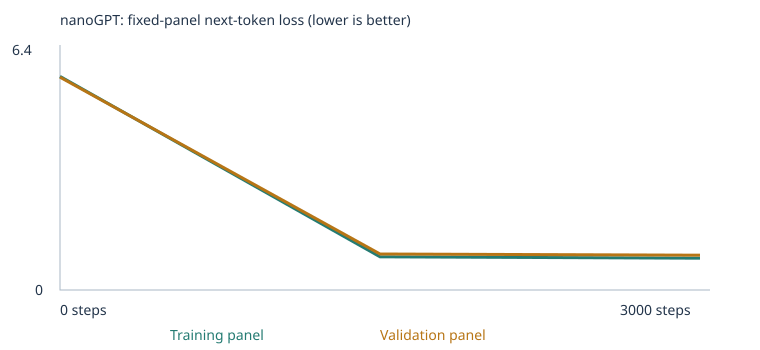
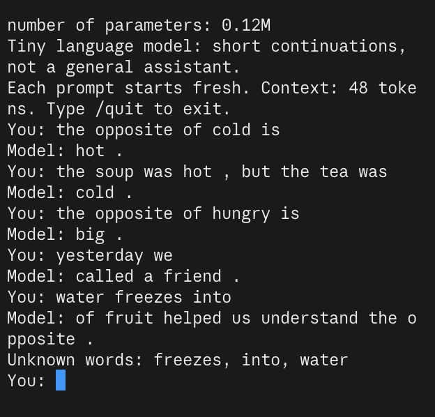

# My Custom LLM Experiment

Class 4 · From Zero to AI Agents · Fall 26 · Louise Chan

I trained Karpathy's nanoGPT from scratch (2 blocks, 4 heads, 64-number embeddings,
48-token context, word tokens) twice: once on the classroom corpus, and once on the
classroom corpus plus my own teaching sentences for **grammar** and **opposites**.
Both runs used the unchanged 48-case language eval suite before and after training.
Everything below comes from the saved files linked in each section. The course's
original README is kept as [COURSE_README.md](COURSE_README.md).

| | Starter experiment | Expanded experiment |
|---|---|---|
| Run folder | [`llm_runs/20260922T220917_902098Z`](llm_runs/20260922T220917_902098Z) | [`llm_runs/20260922T232248_644367Z`](llm_runs/20260922T232248_644367Z) |
| Executed notebook | [starter_run.executed.ipynb](starter_run.executed.ipynb) | [extended_run.executed.ipynb](extended_run.executed.ipynb) |
| Corpus | classroom sentences only | classroom + [corpus/](corpus/) (2 files) |
| Training steps / learning rate | 3,000 / 0.001 | 3,000 / 0.001 |
| Vocabulary | 136 tokens | 336 tokens |
| Unique passages (after removing duplicates) | 4,592 (1,608 duplicates removed) | 9,545 (4,953 new from my files) |
| Train / validation passages (90/10) | 4,132 / 460 | 8,590 / 955 |
| Parameters | 111,872 | 124,672 |
| Training time (CPU, Apple silicon Mac) | 15.7 s | 14.4 s |
| Model hash (final) | `bf49f05b…` | `11434360…` |
| Run files | [config](llm_runs/20260922T220917_902098Z/config.json) · [training.csv](llm_runs/20260922T220917_902098Z/training.csv) · [training_summary](llm_runs/20260922T220917_902098Z/training_summary.json) · [corpus_manifest](llm_runs/20260922T220917_902098Z/corpus_manifest.json) · [tokenization](llm_runs/20260922T220917_902098Z/tokenization.json) · [inspection](llm_runs/20260922T220917_902098Z/inspection.json) | [config](llm_runs/20260922T232248_644367Z/config.json) · [training.csv](llm_runs/20260922T232248_644367Z/training.csv) · [training_summary](llm_runs/20260922T232248_644367Z/training_summary.json) · [corpus_manifest](llm_runs/20260922T232248_644367Z/corpus_manifest.json) · [tokenization](llm_runs/20260922T232248_644367Z/tokenization.json) · [inspection](llm_runs/20260922T232248_644367Z/inspection.json) |

Neither run was interrupted. Unknown-token rate was 0.00% for training and held-out
text in both runs ([starter vocabulary report](llm_runs/20260922T220917_902098Z/vocabulary_report.json),
[expanded vocabulary report](llm_runs/20260922T232248_644367Z/vocabulary_report.json)). Both vocabularies are far below the 509-type
limit, so no training word was dropped. Unknown words only appear in the **eval prompts**.

## My choices and prediction

**Settings:** classroom corpus, 3,000 steps, learning rate 0.001. I chose the recommended
starting values so my first run would be a fair baseline for comparing my expanded corpus.
One step updates the weights using 32 passages. The learning rate warms up over the first
100 steps, then follows a cosine decay to 10% of its peak.
A learning rate that is too large makes each update overshoot, so the loss jumps around
or becomes non-finite. The notebook stops if that happens. One that is too small makes
updates so tiny that the model may not learn the patterns within 3,000 steps. I did not run
a separate 10-step setup check; the full 3,000-step run completed without errors.

My prediction, written before the first run (in the notebook's prediction cell):

- Validation loss would keep dropping steadily through step 3,000.
- Samples would go from random words to text that is better but still messy.
- "customer"'s nearest neighbors would be other business words.
- The model would do well on the 24 starter tests and poorly on the 24 extension tests.

I did not write a separate prediction before the expanded run. Its notebook still shows the
starter prediction cell.

**What happened:**

| Prediction | Result |
|---|---|
| Loss keeps dropping | ❌ Wrong. Validation loss fell from 4.93 to 0.718 by step 1,500, then only to 0.706 by step 3,000. |
| Samples still messy | ❌ Mostly wrong. Final samples are grammatical, but they copy the corpus's sentence templates. |
| Business-word neighbors | ✅ Right: shopper, client, buyer, subscriber, consumer (cosine similarity 0.97–0.98). |
| Starter good, extension poor | ✅ Right: 16/16 starter patterns, 0/24 extension (all unscorable). |

## Corpus

**Starter:** the notebook's synthetic classroom sentences about shopping, products,
banking, fruit, transport, software, health and education. 160 classroom passages that
contained an eval prompt were removed **before** the split and vocabulary were built
([eval_separation.json](llm_runs/20260922T220917_902098Z/eval_separation.json)).

**Expanded:** I added two text files that I generated with
[extension_corpus/make_extension_corpus.py](extension_corpus/make_extension_corpus.py)
([corpus manifest](llm_runs/20260922T232248_644367Z/corpus_manifest.json)):

| File | Passages | What it teaches |
|---|---|---|
| [corpus/grammar_practice.txt](corpus/grammar_practice.txt) | 3,246 | is/are/am and was/were agreement with many singular and plural subjects. "bird" and "dogs" appear only in neutral sentences, e.g. *"we saw a bird near the river ."* Tense contrasts: *every day … walks*, *right now … is walking*, *yesterday … walked*, *tomorrow … will walk*. 12 different verbs. |
| [corpus/opposites_practice.txt](corpus/opposites_practice.txt) | 1,707 | The frame *"the opposite of X is Y"* with 20 **untested** pairs (big/small, early/late, …). Contrast sentences for all pairs, e.g. *"the soup was hot , but the lemonade was cold ."* |

**Why these two categories:** in the starter run, all 24 extension tests were unscorable.
The starter vocabulary didn't even include *is*, *it* or *not*. Grammar and opposites use
short, repeated patterns that a 0.1M-parameter model has a realistic chance of learning.
They also use everyday words I could teach in varied sentences.

**Sources and permission:** both files are original text I generated for this assignment
with the script above. They contain no copyrighted, private or personal material, so they
are published here. I used no PDFs, so no PDF extraction had to be checked. The notebook
reported no warnings and no ignored files. I checked the previews it printed in section 3,
and I inspected the generated files directly.

**How I kept the tests out of training:**

- The generator rejects any sentence the repository's own leakage matcher flags. The
  notebook runs the same check again on every passage.
- My own check caught one: *"yesterday she walked …"* contains the test prompt
  `yesterday she`. I removed "she" from that template. She still appears with past
  tense elsewhere, e.g. *"she walked to the park yesterday ."*
- The exact test openings `one bird`, `the dogs` and `yesterday she` never appear.
- **Rule added after my first expanded run:** no extension test's last content word is
  ever directly followed by its answer. My first version had "a bird **is** …" (22×),
  "two dogs **are** …" (22×) and "she **walked** …" (2×). Those weren't the test items, but
  they were too close. I removed them and retrained. See
  [Superseded first expanded run](#superseded-first-expanded-run).
- **Stricter rule:** the three tested pairs (hot/cold, empty/full, noisy/quiet) never
  share a sentence with the word *opposite*. The generator asserts this. They only appear
  in contrast sentences, so the "opposite of" frame had to transfer from other pairs.
- Nothing was copied from `evals/`, result files or chat logs. `evals/language_evals.json`
  is unchanged from the course repository (suite hash `1d7c503f…` in every summary).
- **Limits:** exact-match checks can't detect paraphrases. And these 48 tests are public:
  I chose my categories after seeing them fail. This is a development benchmark, not an
  unseen test.

**Corpus quality limitation:** because the sentences are generated from templates, some are
odd, e.g. *"one bread felt bright while the other bread felt dim ."* I also paired
loud/soft, while soft/hard appears in the frame pairs. The validation split is by passage,
so it tests new combinations **within these templates**, not unseen writing styles.

## My evidence

### Loss

These are fixed evaluation panels, **at most 20 training and 20 validation passages each**
([starter history.json](llm_runs/20260922T220917_902098Z/history.json), [expanded history.json](llm_runs/20260922T232248_644367Z/history.json)).

| Experiment | Step | Training loss | Validation loss |
|---|---:|---:|---:|
| Starter | 0 | 4.9263 | 4.9275 |
| Starter | 1,500 | 0.6821 | 0.7182 |
| Starter | 3,000 | 0.6783 | 0.7061 |
| Expanded | 0 | 5.8607 | 5.8377 |
| Expanded | 1,500 | 0.9113 | 0.9889 |
| Expanded | 3,000 | 0.8723 | 0.9546 |

Starter:


Expanded:



**What the loss shows:**
- **Step 0:** the untrained loss equals ln(vocabulary size), which is what even guessing
  scores: ln 136 ≈ 4.91 and ln 336 ≈ 5.82.
- **Plateau:** both runs had flattened by step 1,500.
- **No cross-run comparison:** the expanded run's higher loss does **not** mean it's a worse
  model. Its validation set contains different, more varied sentences, and it chooses among
  more words, so the two loss numbers aren't comparable.
- **No overfitting:** training and validation loss stay close, so the model isn't just
  memorizing its training passages.

### Samples (temperature 0.8)

Starter ([step 0](llm_runs/20260922T220917_902098Z/samples/step_0000.txt), [step 1500](llm_runs/20260922T220917_902098Z/samples/step_1500.txt), [step 3000](llm_runs/20260922T220917_902098Z/samples/step_3000.txt)):

- Step 0: `pear professor bond doctor course harvest team physician journey checking buyer …`
- Step 1,500: `our school has a question about the new educator and lesson .`
- Step 3,000: `the consumer compared the offering after checking the price .`

Expanded ([step 0](llm_runs/20260922T232248_644367Z/samples/step_0000.txt), [step 1500](llm_runs/20260922T232248_644367Z/samples/step_1500.txt), [step 3000](llm_runs/20260922T232248_644367Z/samples/step_3000.txt)):

- Step 0: `return full children bottle bright man a fed brand climbing washing surgeon …`
- Step 1,500: `the opposite of hard is soft .` · `right now lily is calling a friend .`
- Step 3,000: `one child is happy .` · `the new car was mentioned in the traffic report yesterday .`

The visible change happens by step 1,500: random words become complete template sentences.
Between 1,500 and 3,000 the starter samples barely change (the first two lines are
identical), which matches the flat loss.

### Temperature ([starter](llm_runs/20260922T220917_902098Z/temperature_comparison.json), [expanded](llm_runs/20260922T232248_644367Z/temperature_comparison.json))

- **Starter run:** the samples at 0.8 and 1.2 were identical, word for word, and 0.3 changed
  2 of 4 sentences. My interpretation, not tested: this model is so confident about its few
  templates that making sampling more random still picked the same words with this seed.
- **Expanded run:** all three temperatures differed. At 0.3, three of four samples used the
  most common classroom template (*"the new … was mentioned in the … report yesterday ."*).
  At 1.2, the samples mixed in more grammar sentences (*"three horses were at home last
  night ."*, *"every day many birds call a friend ."*). Temperature changes sampling only. No weights
change during generation.

### One word through the model ([tokenization.json](llm_runs/20260922T220917_902098Z/tokenization.json), [inspection.json](llm_runs/20260922T220917_902098Z/inspection.json), starter run)

- Text → tokens → IDs: `today the school focused on lesson …` → `[BOS, 121, 118, 101, 42, 74, 61, …]`
- **customer** is ID **28**. First 8 of its 64 numbers:
  - before training: `-0.0576, -0.0048, 0.0426, 0.0193, 0.0156, -0.0288, 0.0256, 0.0001`
  - after training: `0.0366, -0.0182, 0.1330, 0.1059, 0.0630, 0.0189, 0.1523, 0.0929`
- Nearest neighbors by cosine similarity (all 64 numbers), which I computed from `model_untrained.pt` and `model.pt`:
  - before: bus, educator, helped, bank (all about 0.2, i.e. random)
  - after: shopper, client, buyer, subscriber, consumer (0.97–0.98)
  - "bank" after training: station, kitchen, market, hospital, which are other *places*, not finance words.

**First weight update** (starter, customer's number #1, step 1):

| Before | Gradient | Learning rate | After |
|---:|---:|---:|---:|
| -0.057592 | +0.000693 | 0.00001 (warmup) | -0.057602 |

**Next-token probabilities after "the customer"** (starter):

| | Top predictions |
|---|---|
| Before training | customer 0.016, bus 0.011, educator 0.010, us 0.010, application 0.010 |
| After training | reviewed 0.178, recommended 0.171, ordered 0.169, selected 0.163, compared 0.160 |

### What stayed fixed, what training changed, what changed only at inference

- **Fixed in both runs:** model size, seed 42, 3,000 steps, learning rate 0.001 with the
  same warmup and decay, batch size 32, the 90/10 split method, the 20-passage loss panels,
  and the 48-case suite and its scoring. Also fixed: the sample and eval generation settings
  (temperature 0.8, fixed seeds, 24-token limit).
- **Changed between runs:** only the training text (my two files in `corpus/`). This also
  changed the vocabulary (136 → 336), the random starting weights, and the validation passages.
- **Changed by training:** all 111,872 (starter) or 124,672 (expanded) weights, including every
  embedding vector.
- **Changed only at inference:** temperature (0.3 / 0.8 / 1.2) and chat prompts. These
  reshape sampling from the same saved model; no weights change. The eval runner and chat
  never train.

## My fixed language evals

Suite: [evals/language_evals.json](evals/language_evals.json) (unchanged, 48 cases) · runner: [run_evals.py](run_evals.py) · guide: [evals/README.md](evals/README.md)

| Experiment | Stage | Correct / 48 | Scorable / 48 | Accuracy among scorable cases | Full results |
|---|---|---|---|---|---|
| Starter corpus | Untrained | 9 (18.8%) | 24 | 37.5% | [csv](llm_runs/20260922T220917_902098Z/language_evals/untrained/eval_results.csv) · [summary](llm_runs/20260922T220917_902098Z/language_evals/untrained/eval_summary.json) |
| Starter corpus | Trained | 20 (41.7%) | 24 | 83.3% | [csv](llm_runs/20260922T220917_902098Z/language_evals/final/eval_results.csv) · [summary](llm_runs/20260922T220917_902098Z/language_evals/final/eval_summary.json) |
| Expanded corpus | Untrained | 11 (22.9%) | 30 | 36.7% | [csv](llm_runs/20260922T232248_644367Z/language_evals/untrained/eval_results.csv) · [summary](llm_runs/20260922T232248_644367Z/language_evals/untrained/eval_summary.json) |
| Expanded corpus | Trained | **29 (60.4%)** | 30 | **96.7%** | [csv](llm_runs/20260922T232248_644367Z/language_evals/final/eval_results.csv) · [summary](llm_runs/20260922T232248_644367Z/language_evals/final/eval_summary.json) |

Comparisons: [starter](llm_runs/20260922T220917_902098Z/language_eval_comparison.json) · [expanded](llm_runs/20260922T232248_644367Z/language_eval_comparison.json).
Separation: [starter](llm_runs/20260922T220917_902098Z/eval_separation.json) · [expanded](llm_runs/20260922T232248_644367Z/eval_separation.json).

**By category** (correct / 3 or 8; *u* = unscorable because of unknown words):

| Category | Starter untrained | Starter trained | Expanded untrained | Expanded trained |
|---|---|---|---|---|
| domain_context (8) | 3 | 8 | 2 | 8 |
| domain_place (8) | 3 | 8 | 2 | 8 |
| new_wording (8) | 3 | 4 | 4 | 8 |
| **grammar** (3) | 0 u | 0 u | 1 | **2** |
| **opposites** (3) | 0 u | 0 u | 2 | **3** |
| negation, reference, sequence, spatial_relations, everyday_knowledge, categories_and_analogies (3 each) | 0 u | 0 u | 0 u | 0 u |

### Three different measurements

1. **Four-choice score:** the model reads only the prompt. The runner compares the model's
   probabilities for the four candidate words; the model never sees the choices.
   Random guessing averages 25%.
2. **Free continuation:** the model's own unconstrained text at temperature 0.8. It is
   saved but **not graded**, and it can disagree with the four-choice result. For example,
   the starter model picked `patient` correctly for *"the report about the surgeon explains
   the"*, but freely wrote `treatment in detail .`
3. **Vocabulary coverage:** a case is scorable only if every prompt word and answer choice
   is in the model's vocabulary. Coverage went from 24/48 to 30/48. **More training steps
   cannot change coverage**; only new training text can.

### What changed, and why

- **Grammar and opposites: 0/6 → 5/6.** The first reason is **coverage**: all six cases
  became scorable. The second is **learned patterns**, which were strong for opposites and
  weak for grammar:
  - Opposites were confident: `cold` 0.91, `full` 0.91, `quiet` 0.86, even though the
    tested pairs were never next to "opposite".
  - **Grammar failure:** after "one bird" the model chose `were` (0.11) over `are` (0.08),
    with `is` at only 0.002. Its free continuation was `were busy last night .` It did not
    learn that "one" means singular. In my superseded first run, which contained
    "a bird is …", this case passed with `is` at 0.35. That shows the earlier success came
    from the specific word pair, not from grammar.
  - "the dogs" → `are` passed, but barely (0.03). "yesterday she" → `walked` passed at 0.08.
    The model preferred other past verbs; its free continuation was `climbed the hill .`
    It learned "past tense after yesterday", not "walked" specifically.
  - The untrained expanded model got 3 of these 6 right by chance (`are`, `cold`, `full`).
    That's why I compare trained against untrained results rather than reading one score alone.
- **New wording: 4/8 → 8/8. I can't fully explain this.** In the starter run all four
  choices had probability of about 0.000, so the model was ranking near-zero numbers, and
  4/8 was weak evidence. In the expanded run most rose to 0.04–0.25,
  though three stayed below 0.01 (route, update, delivery), so part of this may still be luck. The new corpus changed
  the vocabulary, the random starting weights and the data mix all at once, so this
  comparison can't isolate the cause.
- **18 extension cases are still unscorable** (negation, reference, sequence, spatial,
  everyday knowledge, categories), because I didn't teach those words. I
  can't claim anything about those skills.

**Free continuations for my six chosen cases** (temperature 0.8, not graded):

| Prompt | Starter trained (unscorable) | Expanded trained |
|---|---|---|
| one bird | `the new customer with another client at the store .` | `were busy last night .` |
| the dogs | `the new educator with another educator at the school .` | `are calm .` |
| yesterday she | `the new buyer with another client at the store .` | `climbed the hill .` |
| the opposite of hot is | *(empty)* | `cold .` |
| the opposite of empty is | *(empty)* | `full .` |
| the opposite of noisy is | *(empty)* | `quiet .` |

The starter model saw these prompts mostly as `<UNK>` tokens, so it fell back to its shopping
templates or produced nothing. The expanded model's free text agrees with its four-choice
selections. For "one bird" both are wrong (`were`). For "yesterday she" the four-choice test
marked `walked` correct, but the model freely wrote a different past verb.

**Rerun from the terminal** (these reproduced the notebook's 20/48 and 29/48 exactly;
outputs in [results/rerun-starter-final](results/rerun-starter-final) and [results/rerun-expanded-final](results/rerun-expanded-final)):

```sh
python run_evals.py --model llm_runs/20260922T220917_902098Z/model.pt --output results/rerun-starter-final
python run_evals.py --model llm_runs/20260922T232248_644367Z/model.pt --output results/rerun-expanded-final
```

## My chat interface

Terminal interface: [chat.py](chat.py). It uses my trained expanded model
(`llm_runs/20260922T232248_644367Z/model.pt`, hash `11434360…`). Each prompt starts fresh,
with no shared history. Context is 48 tokens, temperature 0.8, at most 24 tokens per reply.
Unknown prompt words are reported. The model continues text; it does not answer questions.

Setup: `python3 -m venv .venv && source .venv/bin/activate && pip install -r requirements.txt`. The saved model
is included in this repository, so there is nothing to download. Then:

```sh
python chat.py --model llm_runs/20260922T232248_644367Z/model.pt --transcript results/my_new_chat.json
```

Transcript: [results/expanded_chat.json](results/expanded_chat.json). It records the model path and
hash `11434360…`, which match the expanded run. The screenshot shows the same session:



| My prompt | Model reply | What it shows |
|---|---|---|
| the opposite of cold is | hot . | Works in reverse, which no eval tests |
| the soup was hot , but the tea was | cold . | The contrast pattern works in a new sentence |
| the opposite of hungry is | big . | **Failure:** "hungry" was never in an opposite pair, so it made up an adjective |
| yesterday we | called a friend . | Uses a past-tense verb after "yesterday" |
| water freezes into | of fruit helped us understand the opposite . | **Failure:** all three words unknown (`<UNK>`), so the reply is noise |

The notebook's section 10 also saved one interaction per run with the default prompt
"the customer":
- starter model: `selected the item after checking the price .`
- expanded model: `compared the offering after checking the price .`

## What I learned

1. **Corpus:** the classroom corpus teaches which words appear in the same sentence
   templates. It has no grammar variety, opposites, stories or facts. We hold out 10% of
   passages to check that the model learned patterns rather than just memorizing its
   training passages.
2. **Token, ID, embedding:** a token is a word, text or symbol that the model reads and
   creates. In my model, each whole word or punctuation mark is one token. An ID is where
   the word's numbers are stored for reading and retrieval. Customer's ID was 28, but the
   number itself means nothing. An embedding uses numbers to represent a word so the model
   can work with it: 64 numbers per word that start random and are changed by training.
   Customer and shopper ended up almost identical (0.97) because the classroom corpus puts
   them in exactly the same sentences. The same predictions worked for both, so training
   pushed their numbers together.
3. **Neural network, loss, gradients:** the gradient tells the model which direction would
   increase the loss, so each weight moves a small step the opposite way. Customer's first
   number had a positive gradient (+0.000693), so it moved *down* on step 1, from -0.057592
   to -0.057602. One step is tiny, but after 3,000 steps, with the learning rate warming up
   and then decaying, it moved from -0.058 to +0.037.
   This is a neural network because it passes each word's numbers through layers of
   weighted sums and curves, with the output of one layer feeding the next. Training
   adjusted its 111,872 weights thousands of times so these layers connect words to
   likely next words.
4. **Attention:** attention uses percentages to decide how much information to take from
   each earlier word. In my starter model, "customer" took 49% from the start marker, 42%
   from "the" and 9% from itself (first head, first block). In the expanded run it was
   50% / 50% / 1%. It can't look at future words, because the next word is the answer it's
   trying to predict. Seeing it would be cheating.
5. **Probabilities → text:** before training the model spreads probability evenly because
   it has learned nothing. After training it matches how often each word actually followed
   that context in the corpus. After "the customer" it gives about 0.17 to each of the
   verbs that follow it in the corpus. Sampling picks one word according to those
   probabilities, and temperature only reshapes them; no weights change.
6. **Did the evidence support my prediction?** Partly. Neighbors and eval results matched.
   Loss and sample quality didn't: the model learned the templates by step 1,500, and
   extra steps changed almost nothing.

## One limitation and my next experiment

**Limitation:** my model learned *specific pairs*, not general rules. It answered
`the opposite of hungry is` with `big .`, and after "one bird" it chose `were` instead of `is`, and 18 of 48 tests remain unscorable because their
words never appear in training.

**Next experiment:** add teaching sentences for **negation** and **spatial relations**, and
first write 10 new test prompts of my own that I never train on. Keep 3,000 steps and
learning rate 0.001. My prediction: coverage will rise to about 36/48. Spatial inverses
(above/below) may work like opposites, but negation will likely fail, because it requires
tracking which object was *not* chosen, and this model tends to rely on word pairs.

## Superseded first expanded run

My first expanded run ([`llm_runs/20260922T221337_056140Z`](llm_runs/20260922T221337_056140Z),
[notebook](extended_run_v1_superseded.executed.ipynb)) scored 30/48. After it, I audited
the exact training text:
- no eval prompt, prompt + answer, answer-choice list or eval output appeared in it;
- but the grammar file contained "a bird is …" (22×), "two dogs are …" (22×) and
  "she walked …" (2×).

These are ordinary grammar sentences, not test items. Still, each put a tested word directly
before its answer, so I removed them, added the rule to the generator, and retrained with
identical settings. The result fell to 29/48: "one bird → is" went from correct (0.35) to wrong
(0.002). I report the tightened run as my expanded experiment and keep the first run only
for transparency. Its chat evidence is kept as
[results/v1_superseded_chat.json](results/v1_superseded_chat.json) and
[its screenshot](results/v1_superseded_chat_screenshot.png).

## Reproduce

```sh
python3 -m venv .venv
.venv/bin/pip install -r requirements.txt
.venv/bin/python extension_corpus/make_extension_corpus.py   # rebuilds corpus/*.txt
.venv/bin/jupyter notebook custom_llm.ipynb                  # Run All
```

For the starter run, move the two `.txt` files out of `corpus/` before Run All. Each run
creates a new timestamped folder in `llm_runs/`, containing the results ZIP, `model.pt`,
`model_untrained.pt` and `checkpoint.json`. I computed the neighbors in this README from `model.pt` and `model_untrained.pt` with cosine similarity over all 64 numbers. I did not use the 3D viewer for them. To see the embedding viewer, open
[embedding-viewer.html](embedding-viewer.html) and load a run's `checkpoint.json`.
